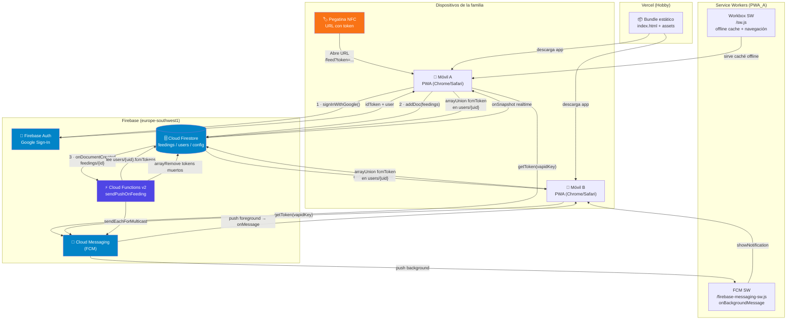

# HappyDog

PWA familiar para coordinar la alimentación de los perros. Evita que nadie dé de comer dos veces por descoordinación. Un solo toque a la pegatina NFC (o un registro manual) lo apunta en tiempo real para toda la familia.

---

## Stack

| Capa | Tecnología |
|---|---|
| Frontend | React 18 + TypeScript + Vite + Tailwind CSS |
| PWA / Offline | `vite-plugin-pwa` (Workbox) + `persistentLocalCache` (IndexedDB) |
| Auth | Firebase Auth — Google Sign-In, sesión permanente |
| Base de datos | Cloud Firestore (Madrid, `europe-southwest1`) |
| Push | Firebase Cloud Messaging (FCM) |
| Workers async | Firebase Cloud Functions v2 |
| Hosting | Vercel Hobby (deploy automático desde `main`) |
| Dev local | Docker Compose + Firebase Emulator Suite |

---

## Diagrama de arquitectura



---

## Flujos de datos

### Flujo NFC (camino principal)

```
Pegatina NFC
  └─► iOS Safari / Android Chrome abre https://happy-dog-alpha.vercel.app/feed?token=<UUID>
        └─► Feed.tsx lee ?token
              ├─ Si no hay sesión → redirige a /login?returnTo=/feed?token=...
              │     └─► Login Google → vuelve a /feed con el returnTo
              └─ Valida token contra config/nfc.token en Firestore
                    ├─ Token inválido → pantalla de error
                    └─ Token válido → createFeeding({ method: 'nfc' })
                          └─► addDoc('feedings/{id}') con timestamp, dateLocal,
                                hourLocal, feederUid, feederName, method, createdAt
                                  ├─► Confirmación visual 2 s → redirect /
                                  └─► [trigger async] → Cloud Function
```

### Flujo manual

```
Home.tsx / ManualFeedDialog.tsx
  └─► Usuario selecciona fecha/hora (≤ ahora, ≤ 24 h atrás, validado con zod)
        └─► createFeeding({ method: 'manual' })
              └─► addDoc('feedings/{id}')  [mismo destino que NFC]
```

### Flujo de notificaciones push (async post-escritura)

```
feedings/{id} creado en Firestore
  └─► onDocumentCreated trigger → sendPushOnFeeding (Cloud Function v2)
        ├─ Comprueba si existe feeding más reciente (evita spam de correcciones)
        ├─ Lee todos los docs de users/
        ├─ Filtra: excluye al feederUid (quien alimentó no se notifica a sí mismo)
        ├─ Recopila fcmTokens de los destinatarios restantes
        ├─ getMessaging().sendEachForMulticast({ tokens, webpush.notification })
        │     ├─► FCM entrega push background → Service Worker onBackgroundMessage
        │     │         └─► showNotification("🐾 Han dado de comer", body)
        │     └─► FCM entrega push foreground → onMessage → toast in-app
        └─ Purga tokens muertos (registration-token-not-registered) con arrayRemove
```

### Flujo de tiempo real (onSnapshot)

```
Cualquier escritura en feedings/
  └─► Firestore entrega el delta a todos los listeners activos
        └─► subscribeFeedings(onSnapshot) en useFeedings.ts
              └─► setState → re-render de FeedingCard en Home / History
                    (sin polling, sin refresh manual, latencia <1 s)
```

### Flujo offline

```
App sin conexión
  └─► Workbox SW intercepta peticiones de assets → sirve desde cache (Cache Storage)
  └─► Firestore SDK con persistentLocalCache (IndexedDB)
        └─► onSnapshot entrega los últimos docs cacheados de la sesión anterior
              └─► Historial visible aunque no haya red
```

---

## Triggers

| Trigger | Cuándo dispara | Qué hace |
|---|---|---|
| `onDocumentCreated('feedings/{id}')` | Cada `addDoc` en la colección `feedings` | Envía push notification a todos los miembros de la familia excepto al que registró |
| `onMessage` (FCM foreground) | Push recibido con la app abierta en pantalla | Muestra toast in-app mediante `useToast` |
| `onBackgroundMessage` (Service Worker) | Push recibido con la app en background o cerrada | Llama a `self.registration.showNotification(...)` |
| `onSnapshot('feedings')` | Cualquier escritura/modificación en la colección | Actualiza el estado local en `useFeedings.ts` → re-render reactivo |
| `onAuthStateChanged` | Cambio de sesión (login, logout, expiración) | Actualiza el store Zustand `useAuth` → redirige a `/login` si no hay sesión |
| `beforeinstallprompt` (browser event) | Chrome detecta que la PWA es instalable | `useInstallPrompt` guarda el evento; `InstallPrompt` lo muestra al usuario |

---

## Modelo de datos (Firestore)

```
users/{uid}
  displayName: string
  email: string
  photoURL: string
  fcmTokens: string[]     ← tokens FCM de todos sus dispositivos
  createdAt: Timestamp

feedings/{autoId}
  timestamp: Timestamp    ← cuándo ocurrió la comida (puede ser pasado)
  dateLocal: string       ← "YYYY-MM-DD" (para agrupar por día sin UTC hell)
  hourLocal: number       ← 0-23 (para stats futuras por franja horaria)
  feederUid: string
  feederName: string
  method: "nfc" | "manual"
  createdAt: Timestamp    ← serverTimestamp(), cuándo se escribió el doc

config/nfc
  token: string           ← UUID del tag NFC; el cliente valida que coincida

config/schedule           ← (futuro F8)
  meals: [{ id, label, startHour, endHour }]
  timezone: string
```

---

## Desarrollo local

```bash
# Levanta Firebase Emulator Suite (Auth + Firestore + Functions) en Docker
docker compose up -d
# Emulator UI: http://localhost:4000

# Semilla de datos de prueba
npm run seed

# Dev con hot-reload conectado a los emuladores
npm run dev          # http://localhost:5173
```

Los emuladores detectan automáticamente los triggers: escribir en Firestore desde la UI del emulador dispara `sendPushOnFeeding` localmente, con el log visible en `:4000`.

**Nota:** el push real via FCM solo funciona contra Firebase real con móvil físico. En el emulador, la función ejecuta y loguea el payload pero FCM no entrega notificaciones.

---

## Deploy

```bash
# Reglas Firestore
firebase deploy --only firestore:rules --project happydog-prod

# Cloud Functions
cd functions && npm run build
firebase deploy --only functions --project happydog-prod

# Frontend (Vercel auto-deploy desde main)
git push origin main
```

Producción: `https://happy-dog-alpha.vercel.app`
