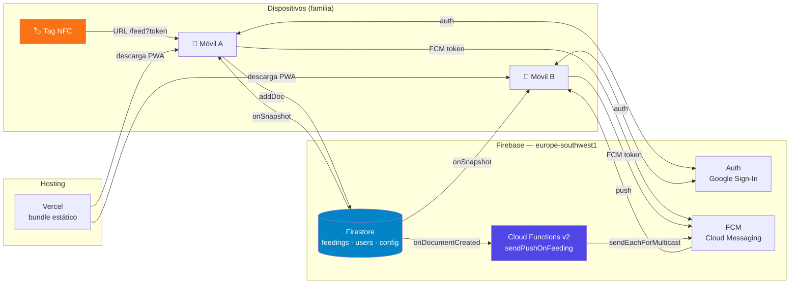
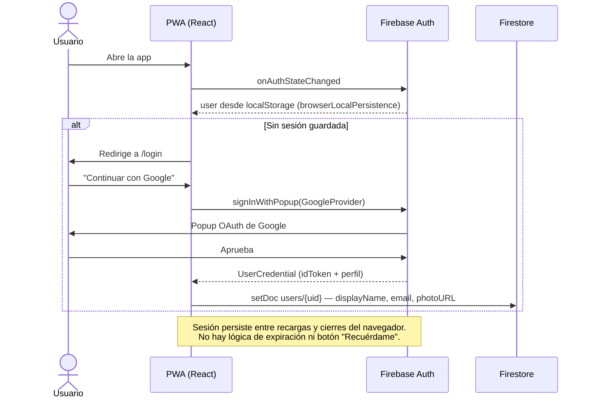
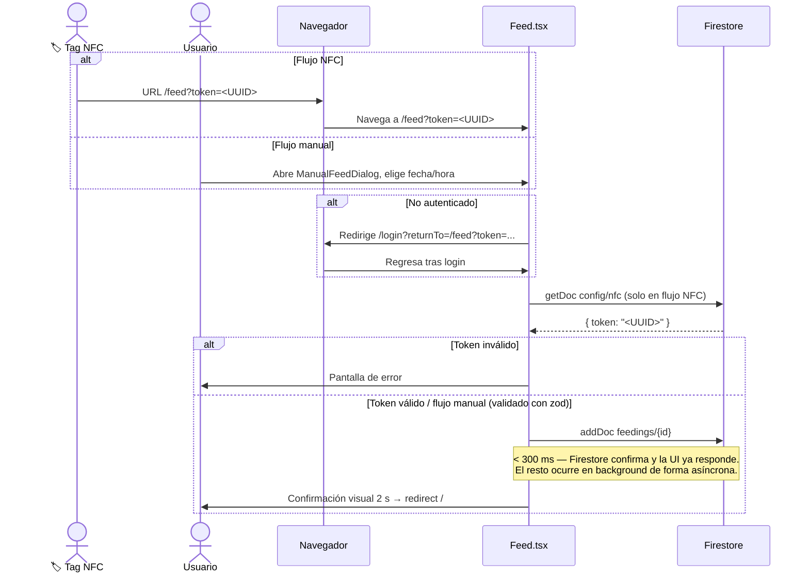
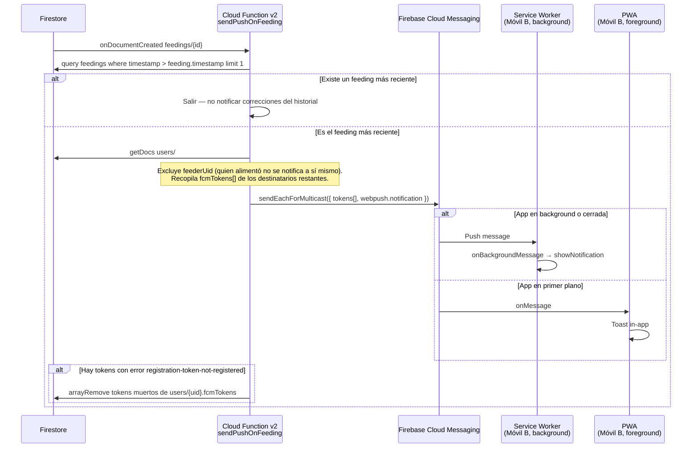
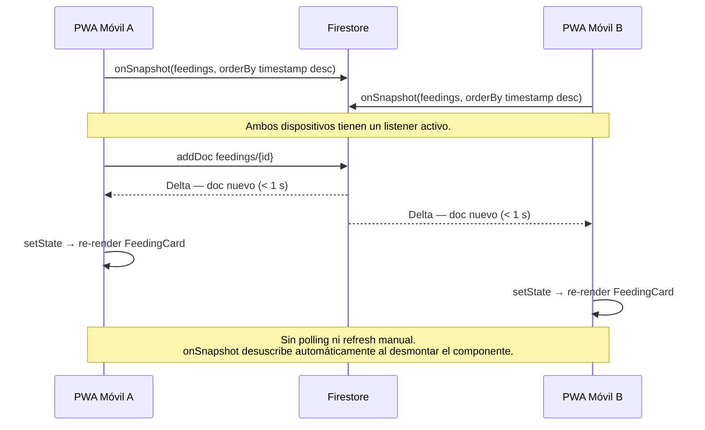
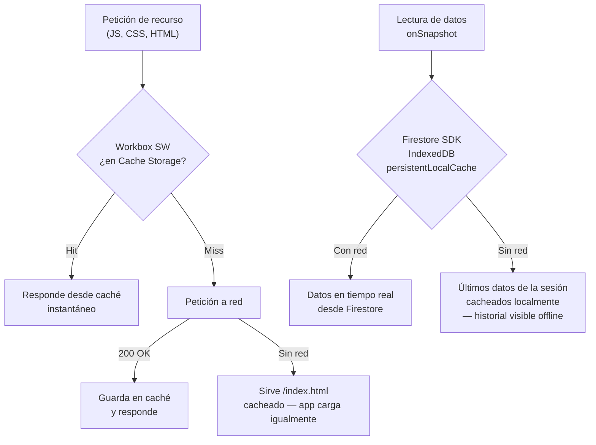

# HappyDog

PWA familiar para coordinar la alimentación de los perros. Evita que nadie dé de comer dos veces por descoordinación. Un solo toque a la pegatina NFC (o un registro manual) lo apunta en tiempo real para toda la familia.

---

## Stack

| Capa | Tecnología |
|---|---|
| Frontend | React 18 + TypeScript + Vite + Tailwind CSS |
| PWA / Offline | `vite-plugin-pwa` (Workbox) + `persistentLocalCache` (IndexedDB) |
| Auth | Firebase Auth — Google Sign-In, sesión permanente |
| Base de datos | Cloud Firestore (Madrid, `europe-southwest1`) |
| Push | Firebase Cloud Messaging (FCM) |
| Workers async | Firebase Cloud Functions v2 |
| Hosting | Vercel Hobby (deploy automático desde `main`) |
| Dev local | Docker Compose + Firebase Emulator Suite |

---

## Arquitectura general

Vista de pájaro de todos los sistemas y cómo se conectan.



---

## Flujos de datos

### 1 — Autenticación



---

### 2 — Registro de comida (NFC y manual)



---

### 3 — Notificaciones push (trigger asíncrono)



---

### 4 — Tiempo real (onSnapshot)



---

### 5 — Offline y caché



---

## Triggers

| Trigger | Origen | Qué hace |
|---|---|---|
| `onDocumentCreated('feedings/{id}')` | Firestore — Cloud Functions v2 | Envía push a la familia excepto al feeder; purga tokens muertos |
| `onSnapshot('feedings')` | Firestore SDK — cliente | Actualiza `useFeedings` → re-render reactivo en Home / History |
| `onAuthStateChanged` | Firebase Auth SDK — cliente | Actualiza store Zustand `useAuth`; redirige a `/login` si no hay sesión |
| `onMessage` | FCM SDK — cliente (foreground) | Muestra toast in-app vía `useToast` |
| `onBackgroundMessage` | Service Worker FCM (background) | `showNotification(...)` del sistema operativo |
| `beforeinstallprompt` | Browser event (Android Chrome) | `useInstallPrompt` captura el evento; `InstallPrompt` lo presenta al usuario |

---

## Modelo de datos (Firestore)

```
users/{uid}
  displayName: string
  email: string
  photoURL: string
  fcmTokens: string[]     ← un token por dispositivo registrado
  createdAt: Timestamp

feedings/{autoId}
  timestamp: Timestamp    ← cuándo ocurrió la comida (puede ser pasado)
  dateLocal: string       ← "YYYY-MM-DD" (agrupa por día sin UTC hell)
  hourLocal: number       ← 0–23 (base para stats futuras por franja horaria)
  feederUid: string
  feederName: string
  method: "nfc" | "manual"
  createdAt: Timestamp    ← serverTimestamp(), cuándo se escribió el doc

config/nfc
  token: string           ← UUID del tag; el cliente valida que coincida

config/schedule           ← (futuro F8)
  meals: [{ id, label, startHour, endHour }]
  timezone: string
```

---

## Desarrollo local

```bash
# Levanta Firebase Emulator Suite (Auth + Firestore + Functions) en Docker
docker compose up -d
# Emulator UI: http://localhost:4000

# Semilla de datos de prueba
npm run seed

# Dev con hot-reload conectado a los emuladores
npm run dev          # http://localhost:5173
```

Los triggers de Cloud Functions se ejecutan en el emulador: escribir en Firestore dispara `sendPushOnFeeding` localmente, con el log visible en `:4000`. El push real via FCM requiere móvil físico contra Firebase real.

---

## Deploy

```bash
# Reglas Firestore
firebase deploy --only firestore:rules --project happydog-prod

# Cloud Functions
cd functions && npm run build
firebase deploy --only functions --project happydog-prod

# Frontend (Vercel auto-deploy desde main)
git push origin main
```

Producción: `https://happy-dog-alpha.vercel.app`
